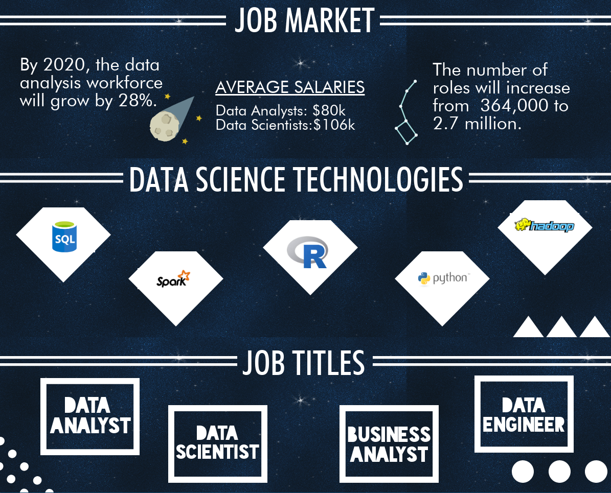

# Project-2-DataScience-job-market

In this project, we built an user-driven interactive dashboard to explore the [Data Scientist Job Market in the US](https://www.kaggle.com/sl6149/data-scientist-job-market-in-the-us).
We will also use the [Indeed Dataset](https://www.kaggle.com/elroyggj/indeed-dataset-data-scientistanalystengineer#indeed_job_dataset.csv), as well as the [Data-Professional-Salary-Survey](https://data.world/finance/data-professional-salary-survey)
We also used the data professional survey from year 2017-1019 to explore the salary change for more than 30 countries over the world. (https://data.world/finance/data-professional-salary-survey).
  
  To help people (including me) to better understand the data science job market, we built a user driven dashboard to What kind of talent do employers want when they are hiring a data scientist; 
  Which locations in the nation have the most opportunities. 
 In this project, SQLite was used as the database. D3, Javascript, Leaflet or Plotly, and Tableau are used to realize the user friendly dashboard.
 Finaly, the full stack app was deployed on Heoku (https://data-science-jobmarket.herokuapp.com/).
